# Chich Virus Game

Very simple game that applies blockchain technology

## Intro

Base on the idea of [Ghost Hunter](https://www.smartgames.eu/uk/try-smartgames-online/one-player-games/ghost-hunters), extend with duet Find Match - 2 players game. The blockchain will save the game result for all players.

Every game match has a Mainboard with 6 Puzzle Pieces and a map with Viruses inside. To solve the puzzle you need to put all Puzzle Pieces fit in the Map square and all the Shields will shield all the Viruses.

## System Design

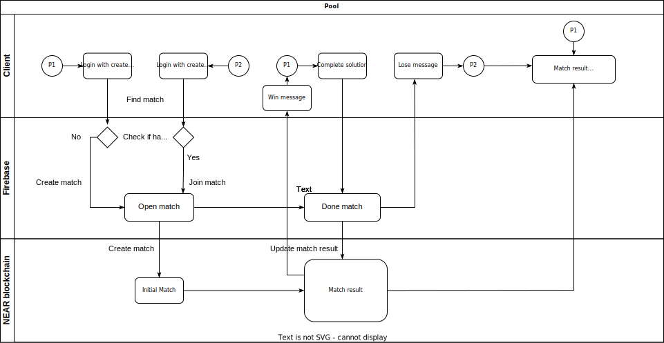

### Client side - Flutter

I choose Flutter and Flame engine for my game so I can have cross platform application.

Flutter source project: https://github.com/mibi2007/chichvirus-flutter

Web Demo: https://mibi-demo.web.app/chichvirus

### Serverless - Firebase

- Firebase Auth helps create account easily and I set one more user property is AccountId which will be use later with smart contract call.

- Realtime database and Firestore store game contents such as game maps, game matches, solutions...

- Firebase Functions is used to Find Match feature and call RPC api to smart contract.

Firebase Hosting for the [Web Demo](https://mibi-demo.web.app/chichvirus)

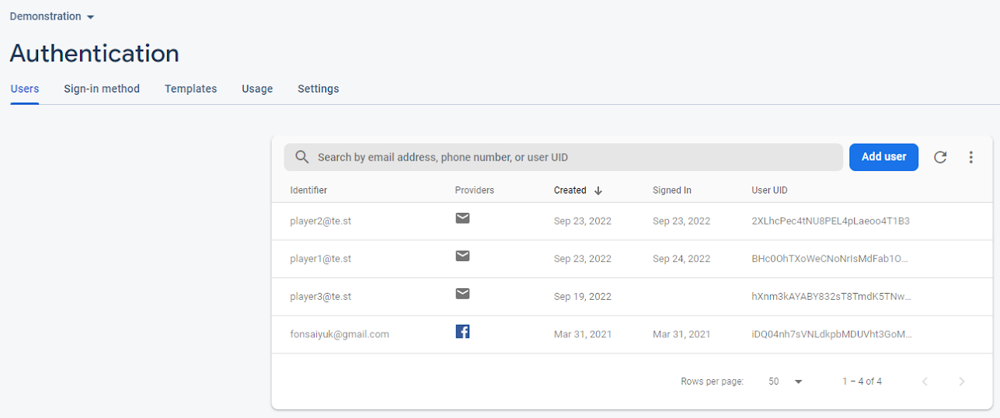
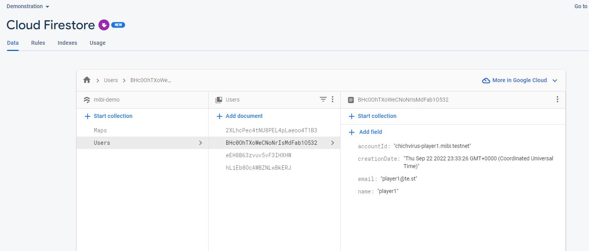

- Support api checking result at

https://us-central1-mibi-demo.cloudfunctions.net/api/get_match/0d2c2a70-259e-419c-b4f2-9197b015fbdc

You will see both match data on Firebase and blockchain.

Source code: https://github.com/mibi2007/chichvirus-firebase

### NEAR blochchain

- All the match result are saved on blockchain.

- Everyone can see and check these results.

Source code: https://github.com/mibi2007/chichvirus-game-contract

## Screenshots

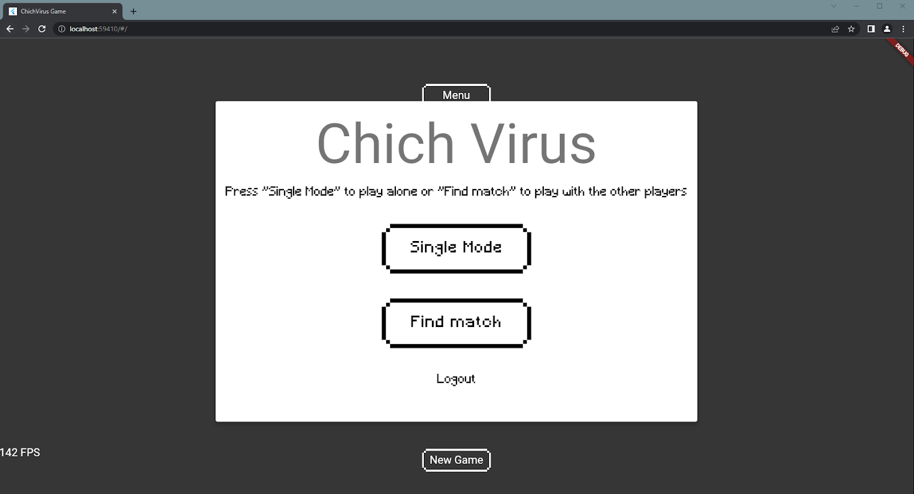
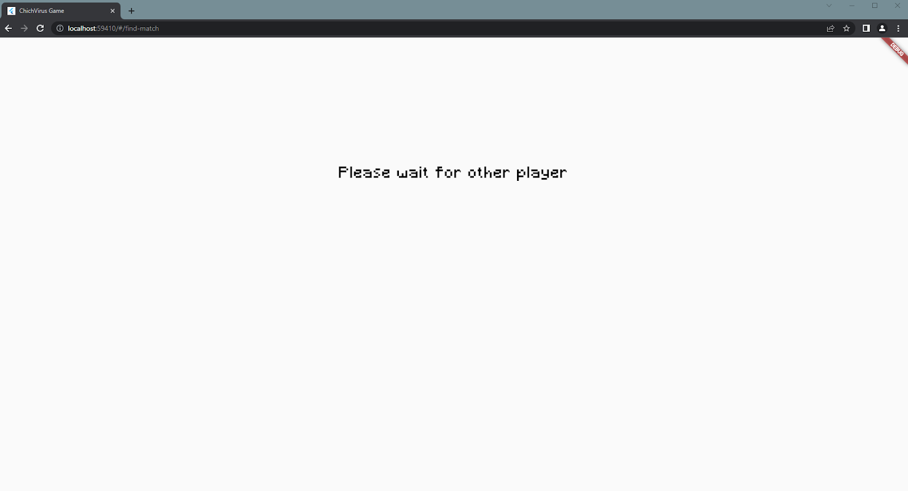
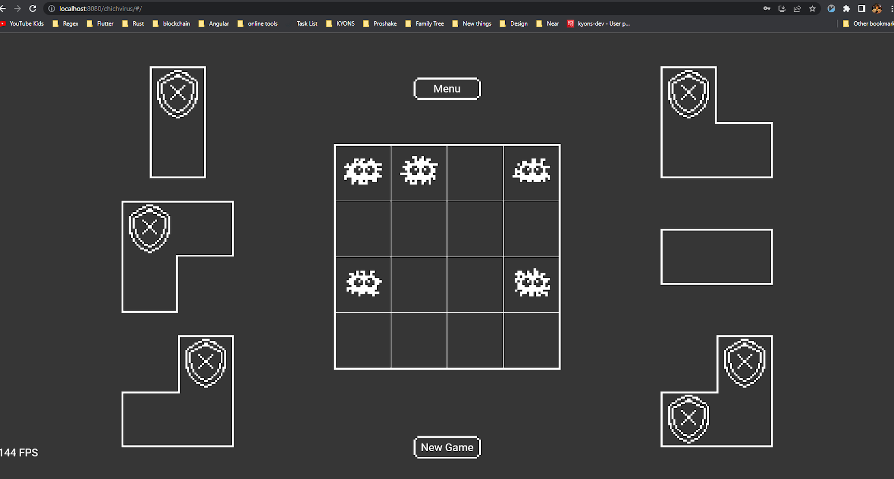
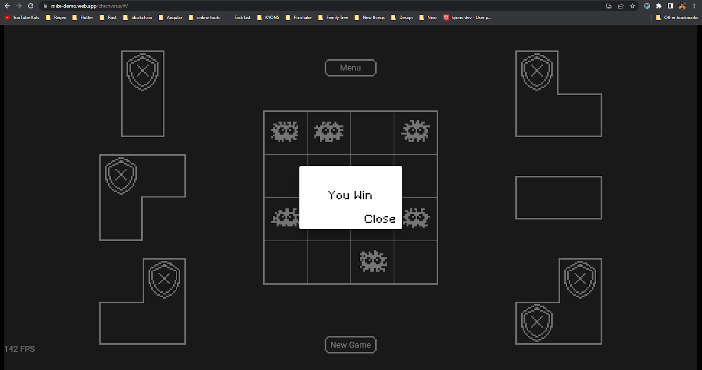
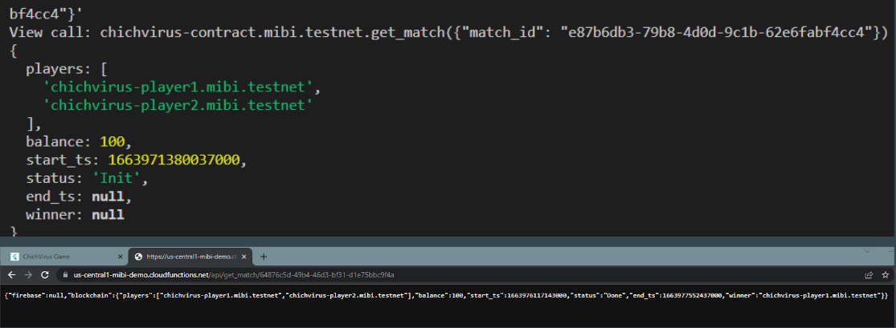
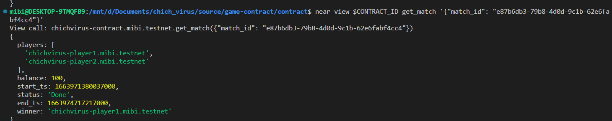

## Missing features and need improve part

- Game does not have good graphic, effects and sound yet.
- Flutter support multiple platform, however some library such as Firebase doesn't support Windows. The Android and iOS can be done but need some more efforts.
- Missing Non Fungible Token (NFT) for this game is a big part, I will definitely add it.

## Some advantages and the future of this game

- Game use pixel graphic which is very easy to change and improve quality. Thanks to the tool https://minisprit.es/#/
  from [Flame team](https://flame-engine.org/).

- Game data structure are very simple, we can easily create new game map with just some texts
  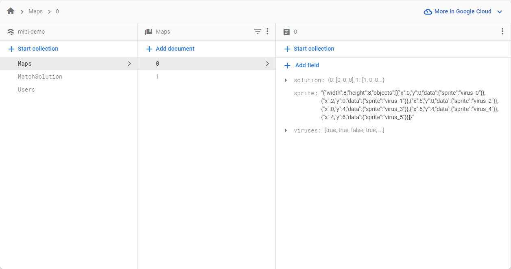

- With that ability, we can even more creative. The map size can be expanded, ex 5x5, 6x6 with more puzzle shapes. Or we can give the creation for all players, they can make maps and challenge with others.

- We can add score system with easy and secure. Practice Score for Single Mode, Exps and Levels for Multiplayer Mode, yes we can have 4 players in a match or 2 players play challenge with some Fungible Token. Win match will give 3 exps, while lose match take out 1 exp. After reaching a spacial level, user can redem a NFT gift from system. It can make user get more exp or can challenge with more price. NTF can also be trade with others and the new owner will take the benefit of it.

- With Flutter, Dart language can call others languages procedure ([Dart FFI](https://blog.logrocket.com/dart-ffi-native-libraries-flutter/)). We can take advantage of it and develop dapp. For example NEAR has [RPC client](https://github.com/near/near-jsonrpc-client-rs) library written in Rust, not Dart, but we can use it. [flutter_rust_brigde](https://github.com/fzyzcjy/flutter_rust_bridge) make it easier (also support web - [here](https://github.com/fzyzcjy/flutter_rust_bridge/pull/589)). [AppFlowy](https://www.appflowy.io/blog/how-we-built-appflowy-with-flutter-and-rust) is one famous POC.
  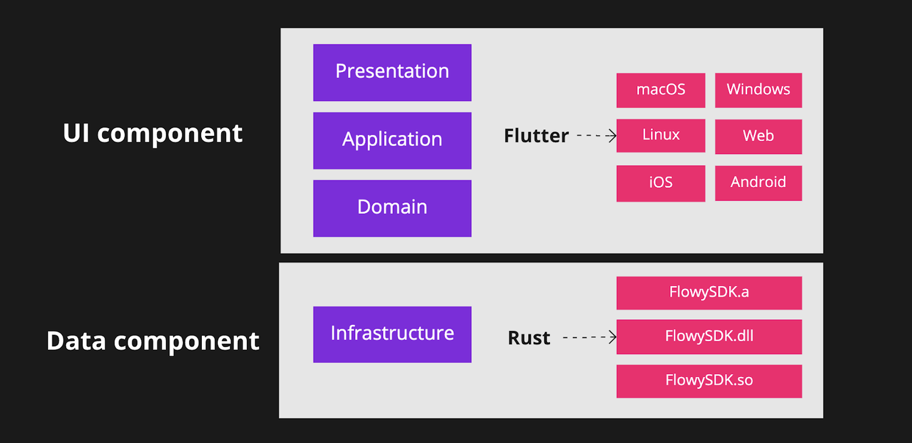

- Moreover, from now on NEAR give us [NearFi](https://docs.nearfi.finance/developer-guide/integrate-nearfi-dapp-browser-into-your-app/sign-in-and-sign-out-with-nearfi) - a very convinient and secure way to login with NEAR, it's still in testnet but there are bright future for dapp, blockchain game on NEAR.

## Special thanks to

- [Vietnam Blockchain Innovation (VBI)](https://www.facebook.com/groups/vietnamblockchaininnovation/)

- [University of Information Technology](https://en.uit.edu.vn/)

- [Flutter Flame team](https://flame-engine.org/)
